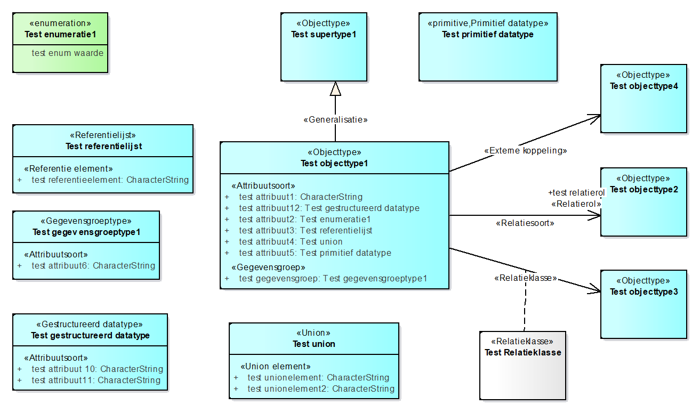

# Bijlagen 

##  Bijlage 1: Abstracte conformiteittoets: Dataspecificatie voor DSO.

<aside class="issue" title="Is deze tekst ook in algemene zin relevant?"></aside>

### Inleiding

De test suite voor de conformiteittoets volgt de regels van ISO 19105 Geographic
information – Conformance and testing. Deze handreiking beschrijft de regels
voor toepassing van dataspecificaties voor het uitwisselen van data binnen het
DSO. Het onderwerp voor toetsing is daarmee bepaald tot dataspecificaties binnen
die context. Met de term dataspecificatie wordt in de test bedoeld het object
dat wordt getest. De conformiteittest bestaat uit testregels die testen of een
dataspecificatie voldoet aan deze handreiking.

### Abstracte test versus Uitvoeringstest

Deze test suite bevat de beschrijving van de abstracte test. Toepassing hiervan
in een uitvoeringsformat leidt tot een uitvoeringstest. Deze laatste bevat een
referentie aan de abstracte test met een concrete uitwerking voor uitvoering. In
de uitvoeringstest is een format opgenomen hoe de rapportage van de uitvoering
van de test wordt weergegeven. In deze abstracte test is daarom geen format voor
de rapportage opgenomen.

Voor het beschrijven van de testregels wordt het volgende format gebruikt:

X.Y Testonderwerp

1.  Testreden: Achtergrond van de test.

2.  Testmethode: Instructie hoe de test wordt uitgevoerd.

3.  Referentie: Onderbouwing met referentie naar dit document.

4.  Testtype: Er zijn twee typen: basistest (basic) en detail(capability).

-   De basistest is een eerste test om algemene regels te verifiëren, de
    detailtest valideert op onderdelen.

De testregel wordt gevalideerd en de uitkomst is één van de volgende
conformiteitklassen

1.  Conform: De dataspecificatie is volledig conform de specificatie beschreven
    in het testonderwerp.

2.  Niet conform: De dataspecificatie is niet conform de specificatie beschreven
    in het testonderwerp.

3.  Niet van toepassing: Het testonderwerp is niet van toepassing voor deze
    dataspecificatie.

### Testregels: ATS dataspecificatie voor DSO

1.1 Scope van de dataspecificatie.

1.  Testreden: Bepaal of van de dataspecificatie die getest wordt het onderwerp
    (scope) valt binnen de scope van het DSO, of een rol gaat vervullen.

2.  Testmethode: Kijk of het onderwerp van de te testen specificatie beschreven
    is en of het valt binnen de scope van het DSO. *Het hoeft niet zo te zijn
    dat een gehele dataspecificatie daaronder valt. Het kan ook gelden voor
    delen van een dataspecificatie.*

3.  Referentie: geen referentie. Deze testregel is niet in alle situaties
    relevant omdat dit document ook voor specificaties buiten het DSO gebruikt
    kan worden. Toch is de testregel hier opgenomen omdat ergens bepaald moet
    worden of een dataspecificatie een rol heeft binnen de context van het DSO.

4.  Testtype: Basistest.

1.2 Modelleringsnotatie.

1.  Testreden: controle op gebruik van formele taal voor modelleren.

2.  Testmethode: Verifieer gebruik van UML, specifiek het UML package- en
    klassediagram.

3.  Referentie: 4.1

4.  Testtype: Basistest.

1.3 Metamodel

1.3.1 Metamodel – MIM

1.  Testreden: controle op het gebruik van het beschreven metamodel.

2.  Testmethode: Verifieer het gebruikte metamodel. De dataspecificatie moet
    aangeven dat het MIM metamodel wordt gebruikt of een extensie hiervan.

3.  Referentie: 4.1

4.  Testtype: Basistest.

1.3.2 Metamodel – extensies

1.  Testreden: controle of extensies op het metamodel niet in tegenspraak met
    het metamodel zijn.

2.  Testmethode: Verifieer de extensies op het metamodel. *Zijn de toegevoegde
    stereotypen valide niet in tegenspraak met al gedefinieerde stereotypen?
    Zijn uitbreidingen op stereotypen valide.*

3.  Referentie: 4.1

4.  Testtype: Detailtest.

1.4 Perspectief van modellering.

1.  Testreden: controle of model op logisch niveau is gedefinieerd

2.  Testmethode: Verifieer het niveau waarop het model is gedefinieerd.

3.  Referentie: 4.1

4.  Testtype: Basistest.

1.5 Toepassing MIM alternatieven voor associaties in het informatiemodel

1.  Testreden: controle of alternatief 2 van MIM wordt gevolgd

2.  Testmethode: Zijn de targetrollen van associaties verplicht gebruikt.

3.  Referentie: 4.1.1

4.  Testtype: Detailtest.

1.6 Naamgeving informatie-elementen

1.  Testreden: controle op naamgeving informatie-elementen conform
    naamgevingsconventie

2.  Testmethode: Verifieer of de naamgeving van informatie-elementen,
    objecttype, attributen, associaties de naamgevingsconventie volgt.

3.  Referentie: 4.1.1

4.  Testtype: Detailtest.

1.5 Standaard datatypen

1.  Testreden: controle op gebruik internationale datatypen.

2.  Testmethode: Verifieer of basis datatypen of waardetypen overgenomen zijn
    van internationale standaarden. *Voorbeelden zijn numerieke of alfanumerieke
    velden, datumvelden, boolean constructies, geometrietypen.*

3.  Referentie: 4.4

4.  Testtype: Detailtest.

1.6 Waardelijst voor geen-waarde informatie is toegepast.

1.  Testreden: controle op gebruik van waardelijst om de reden voor het invullen
    van geen waarde te typeren.

2.  Testmethode: Verifieer of de toe te passen waarden conform de opgenomen
    waardelijst is.

3.  Referentie: 4.5

4.  Testtype: Detailtest.

## Bijlage 2: Termen en afkortingen

<aside class="issue" title="Verwijzen naar begrippenkaders, o.a. NEN3610:2022"></aside>

Termen

| **term**                                           | **bron**                | **definitie**                                                                                                                                                             |
|----------------------------------------------------|-------------------------|---------------------------------------------------------------------------------------------------------------------------------------------------------------------------|
| dataspecificatie                                   | [NEN-EN-ISO 19131:2007] | een gedetailleerde beschrijving van een dataset of dataset series samen met additionele informatie ten behoeve van creatie, levering aan of gebruik door andere partijen. |
| domein / sector                                    | NEN 3610                | kennisgebied of activiteit gekarakteriseerd door een verzameling van begrippen                                                                                            |
| informatiemodel                                    | [NEN-EN-ISO 19101:2005] | formele definitie van objecten, attributen, relaties en regels in een bepaald domein                                                                                      |
| geo-informatie                                     | [NEN-EN-ISO 19101:2005] | informatie met een directe of indirecte referentie naar een plaats ten opzichte van de aarde (bijvoorbeeld ten opzichte van het aardoppervlak)                            |
| georeferentie                                      | NEN 3610                | locatie van een ruimtelijk object vastgelegd in een ruimtelijk referentiesysteem                                                                                          |
| model                                              | [NEN-EN-ISO 19109:2006] | abstractie van enige aspecten van de werkelijkheid                                                                                                                        |
| presentatie                                        | [NEN-EN-ISO 19117:2006] | presentatie van informatie aan mensen                                                                                                                                     |
| registratie                                        | NEN 3610                | op nationaal niveau geïdentificeerde en erkende gegevensverzameling                                                                                                       |
| registratiehouder                                  | NEN 3610                | organisatie die unieke objectidentificaties toekent voor objecten in een registratie                                                                                      |
| representatie                                      | NEN 3610                | inhoudelijk vastleggen van de werkelijkheid                                                                                                                               |
| objectcatalogus / feature catalogue                | [ISO/DIS 19110:2013]    | Catalogus met definities en beschrijving van objecttypen, attributen en relaties van één of meer (geografische) datasets, inclusief mogelijk operaties op objecttypen     |
| Werkelijkheid / universe of discourse              | [NEN-EN-ISO 19101:2005] | beeld van de echte of hypothetische wereld dat binnen de context van een domein alles van belang omvat                                                                    |
| Concepten woordenboek / Feature concept dictionary | ISO 19126:2009          | Woordenboek met definities en gerelateerde beschrijvende informatie over concepten die in meer detail beschreven kunnen worden in een objectcatalogus                     |
| dataset                                            | [ISO 19115]             | identifiable collection of data                                                                                                                                           |
| data set series                                    | [ISO 19115]             | collection of data sets sharing the same product specification                                                                                                            |
| register                                           | [ISO 19135]             | set of files containing identifiers assigned to items with descriptions of the associated items                                                                           |
| use case                                           | INSPIRE D2.6            | A *use case* defines a goal-oriented set of interactions between actors and the system under consideration.                                                               |
|                                                    |                         |                                                                                                                                                                           |
|                                                    |                         |                                                                                                                                                                           |

## Bijlage 3: Referentie implementatie MIM-alternatief 2

<aside class="issue" title="Actualiteit controleren"></aside>

Voorbeeld van een UML klassediagram met fictieve informatielelementen.
MIM-alternatief 2 wordt hierin gevolgd. De naamgevingsconventie voor alternatief
2 is hier niet toegepast.

## Bijlage 4: Voorbeeld Dataspecificatie template

<aside class="issue" title="Is deze template ook in algemene zin relevant?"></aside>

<remove>Deze bijlage beschrijft het template dat gebruikt kan worden voor het opstellen
van een dataspecificatie document. Dit template is binnen deze opdracht niet
gestandaardiseerd. Er is een voorbeeld template gemaakt dat als input kan dienen
voor het verder afstemmen van gebruik door informatiehuizen:
Dataspecificatie_Template_DSO.docx. Het voorbeeld is nog niet ontwikkeld voor
toepassing van het metamodel MIM.</remove>
 
  
Bij Geonovum wordt een methode ontwikkeld om de documentatie van
geo-standaarden, waaronder dataspecificaties te beheren van uit een github
omgeving en op het web te publiceren in HTML. Meer informatie hierover: 

 - [Ontwikkelomgeving](https://github.com/Geonovum/respec/wiki)
 - [Voorbeeld 1](https://tools.geostandaarden.nl/respec/test/whitepapertest.html) (H5 is uit een UML gegenereerde objectcatalogus)
 - [Voorbeeld 2](https://geonovum.github.io/Metadata-ISO19115/)

## Bijlage 5: Bibliografie

<aside class="issue" title="Veel relevante documenten voor werkwijze modelleren"></aside>

<aside class="issue" title="Automatisch genereren: verwijzingen in tekst en LocalBiblio opnemen"></aside>

 1. GIMAReader Module 5 UML.
 1. Gemeenschappelijk Afspraken Berichten, GAB (Federatief overleg beheerorganisaties basisregistraties en standaarden). 
 1. Geonovum, iov Ministerie van Infrastructuur en Milieu, 2014. Globaal ontwerp Laaninfrastructuur. 
 1. Geonovum, iov Ministerie van Infrastructuur en Milieu, 2015. Globaal ontwerp Gegevensstromen Laaninfrastructuur. 
 1. Geonovum, iov Ministerie van Infrastructuur en Milieu, 2015. Globaal ontwerp en prototype stelselcatalogus.     
 1. INSPIRE, 2008. Drafting Team "Data Specifications" – deliverable D2.6: Methodology for the development of data specifications. 
 1. INSPIRE, 2014. Drafting Team "Data Specifications" – deliverable D2.5: General Conceptual Model. 
 1. Kaderstellende notitie, URI-strategie. Versie 1.57 Concept 15-05-2017. Deelprogramma Digitaal Stelsel Omgevingswet. 
 1. KING, 2015. Metamodel voor de Referentiemodellen Gemeentelijke Basisgegevens. Versie 0.6. 
 1. Metamodel voor informatiemodellen. 2017. KING, Kadaster, Geonovum
 1. NEN 3610: 2011/A1:2016 Basismodel Geo-informatie – Termen, definities relaties en algemene regels voor de uitwisseling van informatie over aan de aarde gerelateerde ruimtelijke objecten. 
 1. NEN-ISO/IEC 11404:2008 Information technology – General Purpose Datatypes (GPD)
 1. NEN-EN-ISO 19101-1:2014 Geographic information - Reference model - Part 1: Fundamentals
 1. NEN-EN-ISO 19103:2005 Geographic Information – Conceptual schema language.
 1. NEN-EN-ISO 19105:2005 Geographic information – Conformance and testing
 1. NEN-EN-ISO 19107:2005 Geographic information – Spatial schema
 1. NEN-EN-ISO 19109:2006 Geographic Information – Rules for application schema.
 1. NEN-EN-ISO 19110:2006 Geographic information - Methodology for feature cataloguing.
 1. NEN-EN-ISO 19115-1:2014 Geographic information - Metadata - Part 1: Fundamentals.
 1. NEN-EN-ISO 19117:2014 Geographic information – Portrayal.
 1. NEN-EN-ISO 19126:2009 Geographic information - Feature concept dictionaries and registers.
 1. NEN-EN-ISO 19131:2008 Geographic Information – Data product specifications.
 1. NEN-EN-ISO 19135:2007 Geographic information - Procedures for registration of geographical information items.
 1. NEN-EN-ISO 19136:2009 Geographic information - Geography Markup Language (GML).
 1. NEN-ISO/IEC 19501:2005 Information technology – Open distributed Processing Modelling Language (UML) Version 1.4.2
 1. [NPR-CEN/TR 15449-3:2012 Geographic information - Spatial data infrastructures - Part 3: Data centric view](https://www.nen.nl/NEN-Shop/Norm/NPRCENTR-1544932012-en.htm)
 1. [INSPIRE Data Specification Extensions](http://inspire-extensions.wetransform.to/)
 1. Werkgroep URI-Strategie, 2014. [Voorstel URI strategie voor de basisregistraties](http://www.pilod.nl/w/images/1/16/20141009_AdviesURIStrategieBasisregistraties_0.3.pdf)
 1. Werkgroep Best Practices, 2013. Metamodel voor structuurmodellen in (basis)registraties. Whitepaper (Geonovum).