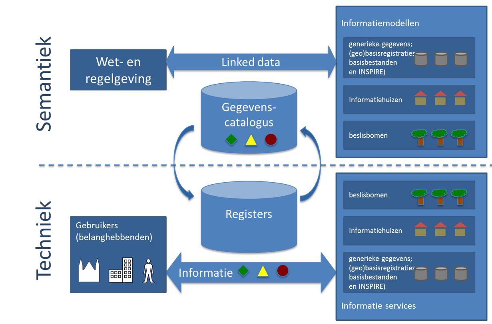
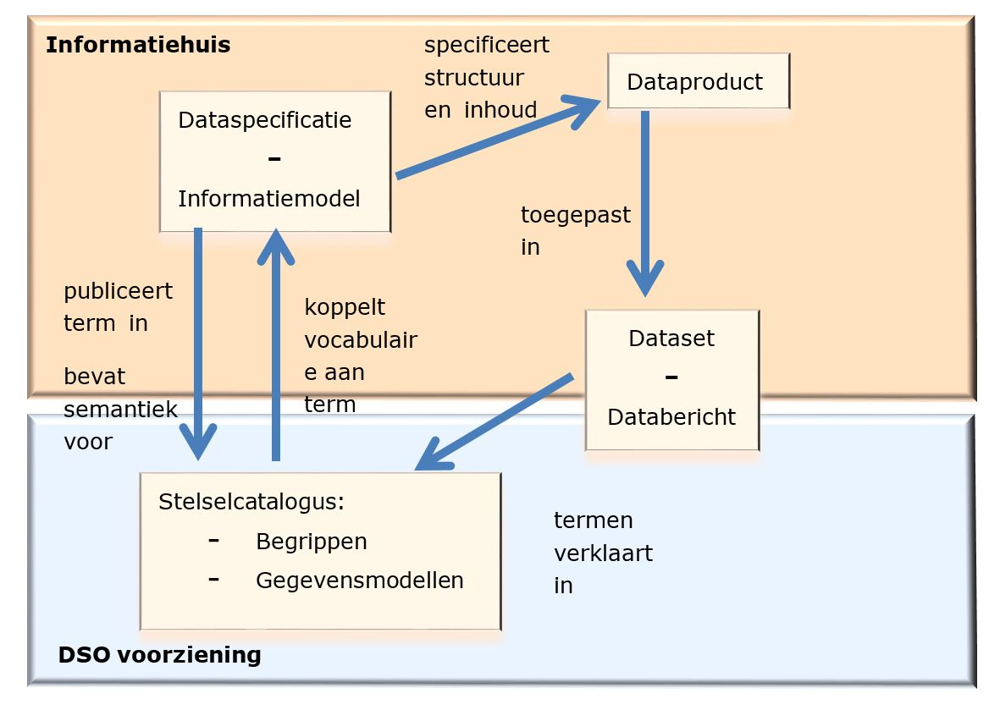

# Informatiemodellering – algemene aspecten

<aside class="issue" title="Hoofdstuk herschrijven">
   <b>G</b>: Waardevolle structuur en onderwerpen. Herschrijven voor modelleren bij Geonovum i.p.v. DSO. 
</aside> 

<remove>In dit hoofdstuk een omschrijving van het gebruik van dataspecificaties en het maakproces in de context van het DSO.</remove>

## Rol van dataspecificaties, informatiemodellen en relatie met stelselscatalogus.

<remove>Het DSO is een infrastructuur voor gegevensuitwisseling, aanbod en gebruik, rond
het thema leefomgeving/omgevingswet. Voor het ontwerp van een infrastructuur
spelen standaarden een belangrijke rol. Een onderdeel van die standaarden
betreft het vastleggen en beschrijven van de semantiek van de registraties
beheerd door de informatiehuizen. Het DSO omvat informatiehuizen;
informatiehuizen bevatten gegevens waarmee informatie wordt gegenereerd en
middels berichten wordt gecommuniceerd. Dataspecificaties beschrijven in detail
de data inhoud van de informatiehuizen en de dataproducten die worden geleverd.
Dataspecificaties ondersteunen de volgende functies:</remove>

    <ul>
        <li><remove>Inwinning van gegevens: definitie van domein, welke gegevens moeten worden ingewonnen (of geleverd);</remove></li>
        <li><remove>Definitie van aanbod: definitie van gegevens die in een dataset of data service zitten. Definitie is tot op hoogste detail niveau (kenmerk, waardetype, multipliciteit);</remove></li>
        <li><remove>Genereren van metadata: deel van informatie is input voor metadata;</remove></li>
        <li><remove>Evaluatie van geschiktheid voor gebruik (door gebruikers);</remove></li>
        <li><remove>Harmonisatie binnen en tussen data aanbod per informatiehuis; informatiedetail maakt inhoudelijke afstemming mogelijk;</remove></li>
        <li><remove>Integrale informatievragen over de domeinen van informatiehuizen heen;</remove></li>
        <li><remove>Specificaties voor applicatie-ontwikkeling. Gedetailleerde beschrijving geldt als specificatie voor informatiehuishouding en berichtenspecificatie, validatie.</remove></li>
    </ul>

<remove>In onderstaand figuur wordt de rol van dataspecificaties, of in beperktere zin,
informatiemodellen, gepositioneerd. Voor dit document betreft het
dataspecificaties voor informatiehuizen.</remove>

<aside class="issue" title="Afbeelding verwijderen">
</aside>

<remove>In figuur 2 is er een centrale rol voor de stelselcatalogus en de toepassing
daarvan in registers. In het rapport Globaal functioneel ontwerp
stelselcatalogus wordt die nader toegelicht. In de stelselcatalogus worden
begrippen opgenomen die betekenis hebben binnen het DSO, hetzij vanuit een
juridisch perspectief van beleid en wetgeving, hetzij van uit een administratief
perspectief van gegevensregistraties. De stelselcatalogus brengt die begrippen
in relatie tot elkaar. Zoekingangen vanuit beide perspectieven leiden daarmee
tot dezelfde gegevens. Tevens zijn in de stelselcatalogus de metadata van de
informatiemodellen opgenomen.</remove>

<remove>Een dataspecificatie richt zich op de overdracht of levering van gegevens. Het
is de ‘view’ op de registraties die geheel gericht is op het leveren van
gegevens. Een dataspecificatie is ook een informatiebron voor de
stelselcatalogus. De gegevenselementen uit een dataspecificatie worden in een
stelselcatalogus gepubliceerd. De stelselcatalogus en dataspecificatie zijn
daarmee complementair. De dataspecificatie puur gericht op de beschrijving van
de registratie, data vanuit het berichtenperspectief en de catalogus gericht op
de semantiek van begrippen en koppeling naar de informatiebronnen.</remove>

<remove>Onderstaand figuur schets de afhankelijkheden tussen een dataspecificatie en
gerelateerde producten.</remove>

<aside class="issue" title="Afbeelding verwijderen">
</aside>

<remove>Figuur 3 - Relaties tussen een dataspecificatie en gerelateerde producten. Een
Dataspecificatie is een product van een informatiehuis en specificeert structuur
en inhoud van datasets of data berichten. De stelselcatalogus is de voorziening
waarin semantiek wordt geïntegreerd over het hele DSO.</remove>

<remove>Figuur 3 heeft twee grote blokken, een gedeelte binnen de structuur van een
informatiehuis en een gedeelte als algemene DSO-voorziening. Informatiehuizen
beschrijven hun producten, data, datasets en berichten door middel van een
dataspecificatie met daarin een informatiemodel. Het informatiemodel publiceert
de semantiek middels termen en definities in de stelselcatalogus. De
stelselcatalogus is een algemene DSO-voorziening die vocabulaire koppelt aan de
termen in een informatiemodel. De stelselcatalogus integreert daarmee de
semantiek van de informatiehuizen/modellen over het hele DSO. Vanuit het
gebruikersperspectief is de stelselcatalogus het meest zichtbaar en vormt de
ingang tot de semantiek en gerelateerde informatiehuizen, data en datasets. Van
belang is om de relatie tussen catalogus en dataspecificatie duidelijk te hebben
zodat er geen overlap optreedt. Daarom wordt de relatie nog iets verder
uitgewerkt.</remove>

<remove><b>Dataspecificatie/informatiemodel</b>: Beschrijft de inhoud en structuur van de
data binnen de context (is domein) van een informatiehuis. De beschrijving is
gericht op het verklaren van de data, datasets en databerichten die een
informatiehuis als producten kan leveren. De beschrijving omvat termen,
kenmerken en relaties tussen termen van toepassing binnen het domein.</remove>

<remove><b>Stelselcatalogus</b>: Bevat het totaal aan begrippen binnen het DSO: het
vocabulaire. Dit vocabulaire is gekoppeld aan de informatiemodellen en verwijst
o.a. naar toepassing daarvan in termen van de informatiemodellen.</remove>

<remove>Een belangrijk verschil is dat de dataspecificatie/informatiemodel opgesteld is
binnen de context van het domein van het informatiehuis en de catalogus de hele
wereld als context heeft. De zogenaamde ‘closed world’ versus een ‘open world’.
In een ‘closed world’ zou een informatiemodel en de catalogus gelijk zijn. Omdat
er meerdere huizen zijn en het DSO in een open wereld opereert (algemene
begrippen, juridische begrippen, administratieve begrippen, vaktaal enz) is een
algemeen vocabulaire of koppeling van vocabulaires nodig. De stelselcatalogus
levert die voorziening. Dat wil niet zeggen dat de semantiek van
informatiehuizen en de gerelateerde informatiemodellen geen harmonisatiedoel
hebben. Dat hebben ze wel.</remove>

<remove>Twee belangrijke relaties tussen catalogus en informatiemodel zijn dat termen
uit een informatiemodel verwijzen naar de begrippen in het vocabulaire van de
catalogus en andersom. Om dit mogelijk te maken is het nodig dat inhoud van een
informatiemodel gepubliceerd wordt in de stelselcatalogus.</remove>

<remove>De stelselcatalogus specificeert hiervoor de volgende toepassingseis:</remove>

>**Registreren van informatiemodellen**: De stelselcatalogus moet functionaliteit bevatten om de informatiemodellen, zoveel als mogelijk geautomatiseerd, te kunnen inlezen

<remove>Voor de opname van metadata in de stelselcatalogus is de volgende eis opgenomen:</remove>

>**Overzicht datasets**: In de stelselcatalogus is bekend welke datasets aanwezig zijn. Van de datasets zijn metagegevens vastgelegd zoals een titel, beschrijving, gebied dat het betreft , etc. Hierdoor weet een applicatie welke dataset voor bepaalde gegevens en plaats benodigd is.

<remove>Beide bovenstaande eisen waaraan de stelselcatalogus moet voldoen stellen ook
voorwaarden aan de informatiemodellen.</remove>

## Principes

<keep>Het basisprincipe achter een dataspecificatie is dat een dataset in voldoende
mate beschreven moet zijn wil data betekenisvol gebruikt kunnen worden.</keep>  <remove>Uit laan
infrastructuur - globaal ontwerp:</remove>

<remove><i>Voor zowel de informatiehuizen als ICT-voorzieningen geldt dat hun standaarden voor uitwisseling altijd gebaseerd zijn op een informatiemodel, waarin de semantiek vastligt. Ieder informatiehuis kent zijn eigen model, maar ook ieder ketenproces (bijvoorbeeld vergunningaanvraag) kent een informatiemodel, waarin de betekenis van informatie is vastgelegd. Deze informatiemodellen worden voor de Laaninfrastructuur op elkaar afgestemd.</i></remove>

<remove>Informatiehuizen hebben daarin een eigen verantwoordelijkheid voor het beschrijven van de betekenis van hun datasets en ook een gezamenlijke verantwoordelijkheid voor afstemming van betekenis tussen informatiehuizen.</remove>

## Het proces

<remove>Het DSO is niet een infrastructuur waarvan alle onderdelen vanuit niets
opgebouwd hoeven te worden. Hetzelfde geldt voor de dataspecificaties van de
informatiehuizen.</remove> <keep>Sommige datasets moeten nog gedefinieerd worden als een
afgeleide van een beschreven toepassingsdomein terwijl andere sets al toepassing
vinden maar nog niet op de juiste manier of nog onvolledig beschreven zijn. Er
is daarom geen algemeen proces te beschrijven. Voor de één zal het een proces
met use-case met requirements en stakeholders zijn terwijl voor anderen een
revers-enginering aan de hand van bestaande uitwisseling en services mogelijk
is. Beide methoden zullen worden toegelicht. Voor beide processen is de
doelspecificatie wel duidelijk. Ongeacht de gevolgde methode is het eindproduct
conform deze beschrijving.</keep>

<remove>Regel: Een dataspecificatie binnen het DSO is conform de in deze handreiking
opgenomen specificaties.</remove>

### Van use case naar dataspecificatie

<remove>Dit wordt verder uitgewerkt in hoofdstuk 5</remove>

<aside class="issue" title="Op andere manier in de tekst verwerken">
    Hier verwacht ik als lezer toch iets. Of hier in korte vorm wat opnemen, of in bovenstaande paragraaf meteen verwijzen naar hoofdstuk Sofware en UML-profiel.
</aside>

### Revers-engineering met bestaande specificaties

<keep>Het komt vaak voor dat datasets nog geen formele dataspecificatie hebben, of nog
geen specificatie hebben die conform dit document is. Meestal is er wel andere
documentatie aanwezig bijvoorbeeld in de vorm van:</keep>

<ul>
    <li><keep>Een specificatie in een andere conceptuele modelleertaal, bijvoorbeeld ERD;</keep></li>
    <li><keep>Een nog niet volledige beschrijving, of nog niet in het voorgestelde format;</keep></li>
    <li><keep>Geen conceptuele beschrijving maar wel een XML schema;</keep></li>
    <li><keep>Geen conceptuele beschrijving maar wel een database model.</keep></li>
</ul>

<keep>In het geval van ERD, XML-schema en database modellen zijn er mogelijkheden om
gedeeltelijk geautomatiseerd te converteren naar UML informatiemodellen. De
conversieproducten leveren dan een eerste versie van een informatiemodel op dat
daarna aangepast kan worden.</keep>

## Rollen in het proces

<remove>Een informatiehuis is verantwoordelijk voor de kwaliteit van de gegevens binnen
het huis en het aanbod daarvan aan het DSO. Van uit die rol is het
informatiehuis verantwoordelijk voor aanwezigheid en inhoud van een
dataspecificatie. In feite is het de inhoudelijke specificatie van het
informatieproduct dat het huis levert of kan leveren.</remove>

<keep>In het proces van de opstelling van een dataspecificatie zijn de volgende
kennisvelden van belang:</keep>

<ul>
    <li><keep>Domeinkennis: inhoudelijke kennis over het domein, data gebruik en toepassing in werkprocessen;</keep></li>
    <li><remove>DSO kennis</remove>: <keep>kennis over architectuur van</keep> <remove>het DSO</remove> <keep>en algemene regels en afspraken. Inclusief relaties, afstemming tussen</keep> <remove>informatiehuizen</remove>;</li>
    <li><keep>Modelleerkennis: Algemene modelleerkennis en informatie analyse, en specifiek voor toepassing binnen</keep> <remove>het DSO;</remove></li>
    <li><keep>Softwarekennis: De relatie tussen specificaties en de haalbaarheid in softwaretoepassing moet worden bewaakt.</keep></li>
</ul>

<keep>De bovengenoemde kennis hoeft niet altijd en tegelijk aanwezig te zijn binnen
een opdracht voor het opstellen van een dataspecificatie. Het is wel zaak dat
het proces zo ingericht is dat alle aspecten aan de orde komen. Voor wat betreft
de rollen zijn de volgende profielen van belang:</keep>

<ul>
    <li><keep><b>Domeinexpert</b>: levert de ervaring en kennis van het domein en de te gebruiken data;</keep></li>
    <li><keep><b>Procesleider</b>: leidt het proces en zorgt ervoor dat de methode wordt gevolgd;</keep></li>
    <li><keep><b>Informatie-analist, UML modelleur</b>: zorgt voor de documentatie van de dataspecificaties inclusief de UML modellering.</keep></li>
</ul>

<keep>Details over verantwoordelijkheden en gedetailleerde afspraken zijn specifiek voor elk</keep> <remove>informatiehuis</remove> <keep>en kunnen hier niet worden opgenomen.</keep>

## Validatie, vaststelling en beheer

<remove>Na het volgen van de methode ligt er een dataspecificatie.</remove>

<aside class="issue" title="Onduidelijke verwijzing">
    Naar welke <i>methode</i> wordt hier verwezen?
</aside>

### Validatie

<keep>Voor het bewaken van de kwaliteit van de toepassing van de methode is een conformiteittoets en procedure daarvoor een bruikbaar middel. Een conformiteittoets is een meet- en controle-instrument maar ook een methode voor review van kandidaat-specificaties. In bijlage 2 is een abstracte versie van een conformiteittoets opgenomen. Voor een operationele toepassing moet die uitgewerkt worden tot concrete testregels en procedure.</keep>

### Vaststelling

<keep>Een volgende stap is de formele vaststelling. Hieraan vooraf gaat meestal een consultatie. Afhankelijk van</keep> <remove>het informatiehuis</remove> <keep>zal dit verschillend ingevuld worden. Een werkveldconsultatie, een nationale consultatie, een beperkte expert consultatie zijn voorbeelden. Centraal staat dat na consultatie en verwerking daarvan een dataspecificatie wordt vastgesteld en bekrachtigd.</keep> <remove>Bekrachtiging is in drie stappen: binnen de context van een informatiehuis, binnen de context van het DSO en op nationaal niveau.</remove> <keep>Als dat doorlopen is, is de dataspecificatie een semantische standaard. De standaard voor de inhoudelijke beschrijving van een domein.</keep>

### Beheer

<keep>Een standaard die niet in beheer is, is geen standaard. Beheerverantwoordelijkheid omvat velerlei facetten die vaak ook situationeel afhankelijk zijn,</keep> <remove>in dit geval ook van de afzonderlijke informatiehuizen. Binnen de context van de individuele informatiehuizen is het</remove> <keep> verstandig te kiezen voor een zelfde algemeen uitgangspunt voor het inrichten van een ontwikkel- en beheeromgeving zoals beschreven in de <a href="https://www.forumstandaardisatie.nl/open-standaarden/voor-beheerders/beheer-van-standaarden/">BOMOS-standaard</a> (Beheer en Ontwikkelmodel Open Standaarden) en het <i>BOMOS2i-stappenplan</i>. Uit deze standaard worden een aantal operationele facetten opgenoemd.</keep>

<ul>
    <li><keep>Communicatie: Promotie en publicatie.</keep></li>
    <li><keep>Implementatie ondersteuning: Helpdesk, Validatie en certificatie.</keep></li>
    <li><keep>Wijzigingsprotocol: Indienen, beoordeling, verwerking.</keep></li>
    <li><keep>Versiebeheer: Visie op operationele toepassing versies en termijnen voor opvolgende versies.</keep></li>
</ul>

<remove>Of er een gemeenschappelijke governance komt van dataspecificaties over de informatiehuizen heen is hier niet te bepalen. Het rapport Globaal ontwerp en prototype stelselcatalogus adviseert om het beheer van semantiek over de informatiehuizen heen bij de stelselcatalogus te leggen. Deze beheerder organiseert het beheer aan de stelselcatalogus in een beheeroverleg met de betrokkenen zoals de modelleurs van de informatiehuizen. Hierdoor kan de stelselcatalogus beheerder vanuit een neutrale rol komen tot harmonisatie-, verbeter- en afstemmingsvoorstellen tussen de dataspecificaties (Globaal ontwerp en prototype stelselcatalogus).</remove>
